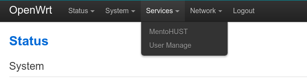

# OpenWrt-mentohust-assistant

应狗神的主意实现的掉线后自动挂校园网脚本

## Requirements

刷了Openwrt的路由器一台，安装了`luci`，并且配置好了`mentohust`

## Install
1. 将`autoconnect`文件夹放在路由器`root`路径
2. 执行`install.sh`

## Usage

`install.sh`已经完成了前端的安装和配置好了开机启动，接下来我们只需要将自己房间的人的校园网账号和mac地址绑定

浏览器输入网关IP`192.168.1.1`，输入密码后进入管理界面，进入`User Manage`界面，绑定mac地址和校园网账号

## About

在断线后，脚本会搜索当前已连接路由器的人，并将其校园网账号挂上
